# Voice Input V1 Architecture

**Status:** Implemented and physically accepted for desktop/local-host V1

**Date:** 2026-09-13

**Repository checkpoint:** `private revision omitted`

**Authority:** Subordinate to the seven founding documents, Architecture Governance, and Target Architecture

## 1. Purpose and decisions

Voice Input is a local-first input and interaction capability of Tori. Recognition supplies candidate text; Tori decides whether it becomes a normal Conversation request. Enabling a microphone grants no permission for actions mentioned in recognized speech. Existing original-text validators, request-origin restrictions, proposals, and confirmations remain authoritative.

The recommended V1 is desktop loopback, explicit On/Off, an explicitly selected microphone, hold or toggle PTT, partial-text presentation, automatic submission after valid finalization, manual barge-in, and recoverable failure. It introduces no always-open conversational listening. A PTT press is the V1 interruption gesture; speaking without pressing PTT is not detected.

The browser speaks only a bounded, Tori-owned Voice Input transport contract. Tori owns a narrow Voice Input service and a replaceable speech-recognition port; the browser never speaks RealtimeSTT's protocol or treats its commands, segment IDs, or events as product semantics. RealtimeSTT runs in a separately provisioned environment on the main host, is started on explicit Voice Input On, and releases its owned models on Off. Its session persists between turns while On. Wake detection has a separate future port and is deferred to V1.1 or later.

This document records the accepted desktop V1 behavior and implementation boundaries. It does not grant later wake, passive-listening, mobile/LAN capture, installation, migration, runtime mutation, or network-exposure authority.

## 2. Evidence and current repository boundaries

The completed isolated proof at `<private-voice-proof>` is accepted technology evidence, not a production runtime dependency. Upstream is [KoljaB/RealtimeSTT](https://github.com/KoljaB/RealtimeSTT), release 1.1.2; the inspected proof source checkout was `07df3600286ea7794cf87d905aab6fccbb09dfc0`. The project license is MIT; implementation must retain applicable notices and verify dependency/model licenses during packaging.

The proof established main-host CUDA `int8_float16`, `tiny.en` realtime and `small.en` final, approximately 706 MiB loaded VRAM delta, persistent session/model reuse, and ten consecutive PTT finals without reconnect, failed jobs, packet rejection, or segment leakage. Average final inference was approximately 64 ms. That measurement excludes browser capture, transport, endpoint drain, and display time; it is not an end-to-end latency promise.

Capture defaults are AGC on, echo cancellation off, noise suppression off, 48 kHz mono, threshold 100, 0.50 s pre-roll, 0.80 s trailing silence, and no digital gain. Browser settings must be inspected after acquisition rather than assumed honored. Normal desk speech through approximately two feet is the supported expectation. Four-foot normal speech worked but does not establish smart-speaker coverage.

Repository evidence that constrains the design:

- `conversation_application.py`: `ConversationTurnService`, immutable `ConversationTurnRequest`, explicit origin/chat/revision binding, and shared foreground admission already exist. Web's local capability choreography still precedes ordinary provider execution; Voice must reuse the entire normal local submission path, not bypass it by calling a provider directly.
- `conversation.py`: `ConversationSession.stream()` commits a user/assistant exchange only after successful stream exhaustion. Incomplete streams close the provider iterator and do not become completed history.
- `web.py`: Web owns local presentation, archive reconciliation, speech integration, and existing normal submission. Its HTTP server is standard-library `ThreadingHTTPServer`, with Host/peer/Origin/CSRF checks and bounded exact-shape requests. It has no general reusable model-generation cancellation endpoint.
- `web_assets/app.js` and `tts.py`: playback already supports immediate local buffer-source stop, speech-fetch abort, playback generation invalidation, and server speech-session stop. Stopping speech alone does not cancel Conversation generation.
- `providers/base.py`: `ProviderStream.close()` exists, but closing a currently executing generator from another thread is not a safe cancellation contract. V1 needs an application-owned cancellable turn handle and provider-transport cooperation.
- `user_settings.py`: non-secret durable preferences already have a private, validated schema boundary. Persisting new Voice preferences requires an explicit future settings-schema migration; no migration or archive schema change is performed here.

The PoC `finalize` operation uses existing nonterminal recorder-backed `stop_streaming()` flushing/draining and the ordinary recorder text worker. Upstream `stop` was not actually a recorder-shutdown operation; disconnect calls shutdown. The production adapter must expose explicit per-turn final/no-speech completion rather than depend on the proof page's timeout heuristic. Preserve upstream `stop` meaning, retain attribution for adapted reference code, and do not copy the entire PoC page/server wholesale into Tori.

## 3. Scope and ownership

### V1

- Master Voice Input Off/On, default Off on process start and browser reload.
- One active desktop browser controller lease and one active utterance. The controller's selected microphone is a browser-local preference, never canonical global Tori state.
- Hold PTT and accessible toggle PTT; no keyboard shortcut requirement.
- Persistent ASR connection and loaded model reuse while On; explicit start/finalize/cancel.
- Presentation-only partial transcript; one valid final candidate automatically submitted through normal local Conversation.
- Compact state beside the composer; ordinary transcript remains primary.
- Manual interruption of TTS at PTT press; bounded generation cancellation after a valid final candidate.
- Stale-event fencing, no-speech completion, timeouts, explicit retry, and typed-input independence.
- Transient raw audio, private non-content diagnostics, lifecycle/resource verification, and physical desktop acceptance.

### Deferred

Wake word/phrase and its engine selection, passive speech-triggered barge-in, dedicated browser VAD, automatic follow-up listening, always-open hands-free conversation, advanced echo cancellation, speaker identification, simultaneous microphones/speakers, far-field guarantees, automatic language switching, streaming speech-to-speech, mobile/iPhone acceptance, HTTPS/LAN microphone access, and remote ASR management are separate future scopes. Editable review-before-send is also deferred; failed/stale admission may recover final text into the existing composer for explicit editing/send in V1.

Tori owns enablement policy, controller leases, immutable interaction state, turn IDs/revisions, PTT and wake policy, interruption, generation coordination, candidate validation/admission, authority, privacy, Settings, failure presentation, and process lifecycle. The browser performs permission/device acquisition, requested DSP, transient buffering, pointer interaction, local playback stop, and rendering under that policy. Web translates the bounded Voice Input transport into service calls; it does not invent ASR business semantics or expose recognition-engine semantics to the client.

RealtimeSTT owns recognition, VAD/signal processing, model loading inside its worker, and ordered recognition results. It cannot select a Conversation, submit a turn, invoke a capability, cancel a model generation, control TTS, persist transcript history, or decide wake/interrupt product policy. Model names, compute settings, raw engine callbacks, and upstream segment IDs remain inside the adapter.

## 4. Browser and transport boundary

Choose **Option B: browser to Tori only**. One same-origin boundary avoids exposing an engine-specific endpoint/protocol to clients and permits a later ASR service on another host without browser redesign. Direct browser-to-RealtimeSTT would simplify one prototype but split policy, lifecycle, origin security, and recovery across two services.

Do not add a handwritten WebSocket implementation to Tori's standard-library HTTP server. V1 uses bounded binary audio POSTs plus the existing style of POST-opened NDJSON event stream. The browser contract contains only Tori product operations: controller enable/disable/status, turn start/audio/finalize/cancel, and sanitized session events. Endpoint names are implementation details; no generic proxy or arbitrary upstream URL is exposed. RealtimeSTT protocol details remain behind `SpeechRecognitionPort` and its adapter.

Each audio request carries a lease/turn identifier and monotonic chunk sequence. The server validates exact metadata, sample format, byte length, sequence, ownership, and limits before accepting binary PCM. Control, audio, and event-stream requests retain existing peer/Host/Origin/CSRF gates; a read-only GET status cannot enable capture. Audio never travels in URLs or logs. Responses/events are `no-store`. Bind the Voice write surface to direct loopback for V1; the existing acceptance of some LAN Web requests does not grant LAN Voice Input.

An initial baseline is 100 ms chunks of mono PCM s16le, with actual sample rate negotiated from a closed supported set (48 kHz preferred, 44.1 kHz accepted and resampled by the adapter). Never relabel unsupported audio as 48 kHz. Maximum packet is 32 KiB, maximum utterance 60 s, and maximum queued unsent audio 1 s. At 48 kHz this bounds current raw PCM to about 5.76 MB per 60-second utterance, apart from bounded recognition working copies. Only one lease/turn is active. Bounds are policy defaults subject to measured acceptance, not model-specific core assumptions.

Use an AudioWorklet where supported, avoiding the proof page's deprecated ScriptProcessor path. Browser PCM conversion and measurement are signal processing only; no browser ASR inference occurs. The initial capture request asks for mono, AGC on, AEC/NS off; inspect `getSettings()` and show unsupported/unhonored requirements truthfully. Do not enable gain compensation or alternate-device fallback silently.

For desktop V1, **On / Ready may retain a visibly armed/open selected browser microphone stream and local capture graph** so browser AGC can settle and PTT preserves the proven pre-roll behavior. Ready is not Listening: while Ready, all raw PCM and any bounded pre-roll buffer remain transient and local to that browser; nothing is forwarded to Tori, the adapter, or RealtimeSTT, and no ASR work is initiated. An authorized PTT start changes the state to Listening and may atomically release only the configured local pre-roll buffer with subsequent turn audio. The UI must visibly distinguish Off (no track), On / Ready (armed local microphone, no transport), and Listening (authorized turn audio transport).

On acquires the selected device after permission and preparation; PTT starts the authorized turn while the already-settled stream remains open. At release, the browser stops forwarding further turn samples, drains already-captured authorized samples into ordered audio requests, waits for their acknowledgments, and sends finalize with the exact final chunk sequence. The Ready stream may remain open after the final so the next turn has settled capture; it must not continue to transport samples. No new chunk can arrive after finalize or join the next turn. Delivery gaps, queue overflow, or unexpected ordering cancel the turn rather than silently sending incomplete speech. Pointer capture, pointer-up/cancel, lost-pointer-capture, and accessible toggle activation must have explicit behavior; a pointer cancel aborts rather than auto-sending uncertain input.

Off is stronger than muting: it stops and releases every browser `MediaStreamTrack`, disconnects the capture graph, clears all transient PCM/pre-roll/measurement buffers, revokes the recognition session/runtime under the lifecycle below, and verifies release of owned ASR models. It must not merely mute or disable a still-open track.

## 5. Voice domain and recognition port

Proposed responsibilities follow existing flat domain/application modules; names may follow repository conventions during implementation:

- `VoiceInputService`: authoritative lease/turn state, policy, fencing, candidate validation, and orchestration with the normal local Conversation application.
- Immutable `VoiceInputSession`/turn snapshots: process epoch, lease, client binding, revision, turn ID, capture sequence, target chat ID/revision, interrupt target, recognition status, and cancellation status.
- `SpeechRecognitionPort`: prepare/open session, start utterance, accept ordered PCM, finalize, cancel/reset turn, close session/runtime, and typed events (`ready`, `partial`, `speech-state`, `final`, `no-speech`, `error`). No Conversation/provider/TTS objects cross it.
- `RealtimeSTTAdapter`: maps this contract onto the existing recorder-backed session and shared final/realtime scheduler. It validates engine events and translates private upstream IDs into Tori IDs.
- An owned runtime supervisor composes the optional adapter and its processes. It does not run recognition in the Web request handler.

Every state-changing operation carries a process epoch, controller lease, lease generation, turn identity, and expected state revision. Audio additionally carries a monotonic sequence. The service validates those fences before accepting audio, a final transcript, an interruption request, or a voice-turn admission. Responses echo the accepted revision; late partial/final results must match all identities and the current turn before presentation or admission. `finalize` is single-flight; duplicate finalize reports an explicit conflict/current state and never schedules a second final. Start during finalizing/admitting is rejected. Cancel/Off fence first, then drain/stop resources. Clear only resets transient transcript presentation; it cannot close the session or cancel a generation implicitly.

The adapter drains the acknowledged last audio sequence and invokes native nonterminal recorder flushing/final transcription on the existing session. It preserves the same recognition connection/models for the next start. VAD may retain pre-roll, indicate useful speech, and suppress obvious no-speech; it cannot admit an intermediate VAD final as a Conversation turn while PTT remains pressed. Configure native manual-turn recording to suppress automatic speech-deactivity stopping while held; speech-start VAD may still gate useful recording, but release controls its end. If the installed recorder still splits segments, normalize them into one explicitly bounded PTT utterance and one authoritative final for the full held audio before admitting input. Prove this with pauses exceeding 0.80 s; a reconnect or one recorder/model per turn is not an acceptable repair. Synthetic-silence finalization is not the selected implementation.

No-speech is an explicit terminal turn outcome. Finalize returns acknowledgment of final pending versus no-speech; a later final or typed no-speech/error completes it. Unlike the PoC UI, a guessed short timeout must not declare the turn reusable while old final work might still publish. Initial finalization timeout is 10 s; cancel/fence the turn, reset its session safely, and report recovery if native work has not quiesced. Never submit a late final.

## 6. Runtime and dependency lifecycle

Recommend **Tori-managed, start on Voice Input On**, not always-running or independently operator-managed V1. Models are pre-provisioned by a separately approved installation step into a dedicated Voice environment outside Tori's ordinary Python environment. On performs no package install, model download, account access, or service registration. Missing assets report unavailable. The PoC path and its environment are never assumed to be production assets.

To preserve standard-library-first Tori, the engine-specific WebSocket client and RealtimeSTT dependencies live in that isolated environment. A narrow supervised adapter bridge uses private inherited stdio framing to the Tori process and maintains one loopback WebSocket to the owned RealtimeSTT worker. Two managed child processes are acceptable here: bridge and model worker. Do not introduce a general subprocess executor. Launch fixed validated executable/argument vectors without a shell, with a minimal allowlisted environment, finite framing limits, and no inherited credentials. Stdio is an IPC channel, not a content log.

The worker uses a narrowly adapted recorder-backed reference session/scheduler plus the proven finalize extension. Its loopback endpoint is private to the adapter, authenticated by a per-spawn secret delivered through an inherited channel; no browser learns the secret. Readiness verifies the worker's owned process/epoch, protocol version, selected profile, and models. An already-bound port is not permission to attach to an unknown process. Actual packaging/licensing/dependency approval is required in Slice 1; the design selects no new Tori-main-environment dependency.

On obtains one explicit controller lease, starts owned processes, loads/warms the configured models, opens the controller's visibly armed local capture stream, and publishes Preparing before Ready. Initial readiness timeout is 90 s, measured and revised if physical startup evidence warrants it. Only successful preparation allows capture. Between turns the socket and models remain loaded; the controller may retain its browser-local microphone stream in Ready, but no raw PCM leaves that browser and no ASR inference is active.

Off immediately revokes the controller lease/epoch, instructs the controller to stop and release every capture track and clear local buffers, rejects all subsequent audio/results/admission, and requests adapter shutdown. Stop and verify the exact owned process group, including model descendants; use a bounded graceful phase (5 s) then targeted termination (5 s). Report Off/cleanup-pending truthfully if resources have not exited; do not claim VRAM release on request alone. No new ASR activity is scheduled after revocation. An in-flight recognition may take until termination to end, which is visible as Stopping. Off does not cancel an already admitted Conversation response or existing TTS output solely because input was disabled.

Exactly one browser/tab may hold the active Voice Input controller lease, microphone capture, and recognition session at a time. Other tabs may receive only sanitized Voice Input status and retain full typed Conversation use; they cannot submit audio, request interruption, finalize a turn, or admit a voice turn. V1 has no takeover: a second tab is told which non-identifying controller state is active and cannot silently replace it. The controller must explicitly turn Voice Input Off, or lose its lease through lifecycle cleanup, before another tab can become controller. A later explicit-takeover feature must visibly request a local user action, revoke and confirm cleanup of the old controller first, then issue a new lease generation; it must never reuse an old lease.

Only the current controller can start/finalize/submit its voice turn or turn Voice Input Off. Reload, close, navigation away, capture-track end, or visibility loss revokes/cancels capture without submitting; the browser stops and releases its tracks and clears local buffers immediately, and Tori uses a heartbeat timeout (5 s, 1 s cadence) for disconnected clients. No hidden-page recording. Tori restart invalidates all leases and returns Off; neither restored preferences nor old browser events reopen capture. No idle timeout shuts down models between normal turns while On, but a lost lease does.

## 7. State and transitions

Input state and Conversation/output state are separate facts, not one global mutually exclusive variable. Generation may continue silently while a new PTT turn is listening. `GENERATING` and `SPEAKING` are projections of existing Conversation/TTS owners, not new Voice-owned execution states. The compact presentation prioritizes Off/error, active listening/finalizing/interruption, then generating/speaking, then Ready. Speech accepted and Interrupted are brief receipts.

```mermaid
stateDiagram-v2
    [*] --> OFF
    OFF --> PREPARING: explicit On
    PREPARING --> READY: runtime and device ready
    READY --> LISTENING_PTT: PTT press / toggle start
    READY --> INTERRUPTING: PTT during generation or speech
    INTERRUPTING --> LISTENING_PTT: capture/start acknowledged; audio stopped
    LISTENING_PTT --> FINALIZING: release / toggle finish + audio drain
    FINALIZING --> USER_TURN_ACCEPTED: valid final + cancellation settled + admission
    FINALIZING --> READY: no speech / recoverable rejection
    USER_TURN_ACCEPTED --> GENERATING: normal Conversation execution
    GENERATING --> SPEAKING: existing speech playback starts
    GENERATING --> READY: completed without speech
    SPEAKING --> READY: playback ends
    GENERATING --> INTERRUPTING: PTT gesture
    SPEAKING --> INTERRUPTING: PTT gesture
    LISTENING_PTT --> READY: explicit cancel
    READY --> ERROR: capture / adapter failure
    LISTENING_PTT --> ERROR: capture / transport failure
    FINALIZING --> ERROR: timeout / unsafe reset / admission barrier
    ERROR --> PREPARING: explicit retry
    READY --> STOPPING: Off / lease lost
    LISTENING_PTT --> STOPPING: Off / lease lost
    FINALIZING --> STOPPING: Off / lease lost
    ERROR --> STOPPING: Off
    STOPPING --> OFF: capture fenced; owned runtime exited
```

Off/lease loss also applies during Preparing, Interrupting, Accepted, Generating, and Speaking; it disables input without rewriting the existing Conversation/output state. Future wake states are attachment points described in Section 10, not executable V1 states.

| Current state / event | Initiator and authoritative owner | Allowed next state / effects | Cancellation and failure rule |
|---|---|---|---|
| OFF + On | User gesture; Voice service | PREPARING; new controller lease/generation, visible permission/device setup, runtime warmup | Denied permission or missing assets → ERROR; no capture/inference |
| PREPARING + readiness | Runtime/device evidence; Voice service | READY; retain models/socket and visibly armed controller-local microphone, with no PCM transport | Timeout/revision loss → ERROR or STOPPING; no automatic retry loop |
| READY + another tab On | Non-controller browser; Voice service | Remain READY; return sanitized busy/controller status | No silent takeover or cross-tab device control; typed Conversation remains available |
| READY + PTT start | Browser user gesture; Voice service | LISTENING_PTT; bind chat/revision, exact microphone, acknowledge start | No usable device/start ack → ERROR; discard buffered audio |
| GENERATING/SPEAKING + PTT | User; playback executor and Voice service | INTERRUPTING then LISTENING_PTT; stop/fence associated speech immediately | Keep generation running silently; failed playback stop blocks capture and reports ERROR |
| LISTENING_PTT + VAD/partial | Recognition adapter; Voice service validates | Remain LISTENING_PTT; presentation updates only | Never submit or cancel generation on VAD alone; stale results dropped |
| LISTENING_PTT + release | User; Voice service | FINALIZING; stop track, drain ordered captured chunks, native finalize | Sequence gap/cancel/limit → discard, ERROR or READY with explanation |
| FINALIZING + valid final | Adapter result; Voice and Conversation services | Retain one candidate; settle targeted cancellation, then USER_TURN_ACCEPTED on normal admission | Admission conflict/timeout → composer draft, not archive; no retry/send automatically |
| FINALIZING + no speech | Adapter terminal result; Voice service | READY; clear transient partial, show no-speech receipt | No generation cancellation or resume of already-stopped TTS |
| USER_TURN_ACCEPTED + dispatch | Normal local Conversation application | GENERATING or existing application-authored response/SPEAKING | Normal authority/confirmation and archive errors apply; Voice cannot re-dispatch |
| GENERATING + completion | Conversation owner | SPEAKING if output is active, otherwise READY | Only successful full exchange committed; incomplete response stays transient |
| SPEAKING + end/stop | Browser/TTS evidence | READY or actual GENERATING projection if generation still active | No generation cancellation implied by output completion/stop |
| Any unaccepted turn + cancel/pointer cancel | User/client lifecycle; Voice service | READY after safe reset; drop audio/partial/candidate | Stop affected speech remains in effect; generation remains intact |
| Any enabled state + Off/lease lost | Controller user/lifecycle; Voice service | STOPPING → OFF; revoke, release tracks/clear browser buffers, discard, stop owned ASR | Fence before cleanup; admitted Conversation unaffected; truthful cleanup warning |
| Any enabled state + fatal error | Capture/transport/runtime evidence; Voice service | ERROR; stop mic, fence current turn, keep typed Conversation | Explicit Retry prepares fresh safe lease/session; never replay audio |
| ERROR + retry | Explicit user; Voice service | PREPARING → READY | No restoration of pending audio/old turn; any unavailable client preference follows the truthful Default-device fallback rule |
| Clear transient transcript | User; Voice service | Same safe state; reset presentation only | While turn pending, clear must not erase its identity/cancellation or terminate socket |

## 8. Conversation admission and interruption

Final ASR text is candidate input, not authoritative Conversation text on arrival. A current valid lease/turn, acknowledged finalize, nonempty bounded normalized text, and matching target chat/revision are required. Confidence is optional adapter metadata; do not invent confidence from engine availability. Explicit no-speech/rejected/unusable recognition never submits. Suspicious or explicitly low-confidence output, where supported, becomes an editable composer draft with a notice rather than an action. Nonempty confident-looking hallucinations cannot be universally detected; existing authority rules still control consequential operations.

V1 auto-submits a valid finalized PTT candidate once. Interim text is never archived, routed as a command, used for Memory extraction, or used to cancel generation. A final accepted text reuses normal local Web submission/capability handlers and `ConversationTurnService`, with server-assigned `RequestOrigin.local_web()`. Voice is an input source, not a privileged origin. Ephemeral `input_source=voice` may help presentation/diagnostics; no archive schema or special voice authority is needed.

A completed ordinary exchange is archived by existing Conversation semantics. Interrupted/failed incomplete exchanges are not promoted to completed model history or Memory. A recognized candidate rejected by admission stays transient in the existing composer, editable before an explicit Send; no background queue/retry survives reload. New-chat/switch/provider-change during capture cancels the turn rather than moving it to a different chat.

### Exact interruption contract

| Existing activity | PTT press | Valid finalized candidate | Empty/cancelled/failed PTT |
|---|---|---|---|
| Only TTS playing | Stop all locally scheduled sources, abort speech fetch, invalidate playback epoch; stop associated server speech session | Admit normal user turn after validation | Remain silent; existing completed assistant text stays archived; replay remains an explicit action |
| Generating and speaking | Same immediate output stop; fence later speech for that exact generation; let model generate silently during capture | Request cancellation of that exact active generation, await quiescence, then normal admission | Do not cancel generation; it may finish as useful text, with automatic speech suppressed for that response |
| Generating, not speaking | Fence that generation's future auto-speech; capture new utterance | Same targeted cancellation and admission sequence | Preserve generation and completed text; no surprise auto-speech after aborted capture |
| Idle | Capture normally | Normal admission | Return READY; no synthetic Conversation turn |

This is manual barge-in. No V1 passive VAD is armed during TTS, so the speaker output cannot itself trigger cancellation. Immediate audio stop occurs on deliberate PTT, not unconfirmed ambient sound. A later automatic mode may use confirmed local speech to stop audio, but generation still requires a valid new user utterance.

Generation cancellation belongs to the Conversation application. Add a narrow handle binding generation ID, process epoch, origin/chat, and commit state; the Voice service requests cancellation through it. Never mutate the raw coordinator flag to pretend a provider has stopped. The execution owner observes cancellation, shuts down/interrupts the provider transport safely, closes its iterator on the owning thread, emits a terminal cancelled receipt, and releases foreground admission only after cleanup. Finite provider-read deadlines bound uncooperative transports; do not close an executing generator concurrently or kill Tori's shared process.

Cancellation and successful completion must share one linearization fence: either successful session-history publication wins (retain the completed exchange; cancellation is already-complete) or cancellation wins before that publication (no completed pair/Memory extraction). The execution owner then performs the existing archive reconciliation and permitted Memory scheduling as completion work; an archive failure remains the existing truthful warning, not grounds for cancellation to delete completed history or retry the turn. Preserve completed assistant text and all existing application events. Preserve already rendered incomplete assistant text visibly as **Interrupted — incomplete** in the current tab, along with its original user message, but keep both out of completed archive/history under existing semantics. Reload truthfully drops this transient incomplete presentation; no new durable interrupted-response record/schema is proposed.

The deterministic ordering rule is:

1. A PTT press may immediately stop and fence browser TTS playback for the exact response, but never requests model-generation cancellation. VAD observations alone neither stop playback nor request cancellation in V1.
2. Release produces a candidate only after an acknowledged final result. An empty, cancelled, failed, stale, or otherwise invalid final ends the Voice turn without cancelling generation.
3. For one valid, nonempty final ready for normal Conversation admission, the Voice service identifies the exact still-active generation and enters its commit/cancel linearization fence. If successful completion/history publication won first, retain and archive that completed response normally, then admit the new user turn against the resulting current revision.
4. If cancellation wins before completion publication, the execution owner cancels that exact generation and waits for quiescence. Its incomplete assistant output remains transient presentation only and must not enter canonical Conversation/provider history as a completed assistant turn; only then may the valid new candidate enter normal admission.
5. A stale target, a newer generation, or a cancellation that cannot quiesce by the deadline leaves the candidate as an editable draft and never cancels unrelated work.

This makes explicit user action authoritative for PTT turn boundaries while keeping useful generation intact until actual nonempty voice input is established.

One validated candidate may wait transiently for its own targeted generation to stop, with a 10 s cancellation/admission deadline. While waiting, status says Finalizing/Stopping current response; no second foreground turn starts. If cancellation cannot settle, do not admit concurrently: retain the candidate as a composer draft and report that Tori is still busy. If generation completed meanwhile, preserve its full commit and attempt normal admission against the resulting authoritative revision only after checking the same chat/interrupt-target lineage. Unrelated revision changes or a newer generation reject the candidate to a draft. Never cancel a newer generation because an older voice result arrived late.

PTT does not cancel Coding Work, scheduled jobs, shell execution, Finance writes, or other capabilities already begun. There is no rollback claim for their effects. If foreground work is not a cancellable model response, capture may yield a draft, but normal admission remains busy until the existing operation ends. Speech recognition is not a general emergency-stop authority.

Stopping browser TTS cannot guarantee a remote model server physically stops computation. Report whether Tori's local stream/turn has quiesced separately from any provider-specific confirmed abort. Browser playback-stop failure is truthful: block new capture until local playback is stopped or manually silenced; do not repeatedly feed echo into ASR while claiming interruption succeeded.

## 9. Privacy, preferences, and failures

Raw audio remains bounded in browser/adapter/recorder memory only and is discarded on final completion, cancel, Off, error, or disconnect. Do not persist WAV/PCM, MediaRecorder blobs, payload dumps, or debugging recordings. Raw audio is not included in backups, Conversation, Memory, model context, or operator logs. Interim/candidate text remains transient until normal admission/archive rules permit durable final text.

The inspected recorder has file logging enabled unless `no_log_file=True`; the client also exposes optional `output_wav_file`, and some alternative engines create temporary WAV files. The selected faster-whisper path accepts in-memory arrays. Production must explicitly use no hardware microphone in the worker, `debug_mode=False`, `no_log_file=True`, no output-WAV/client-recording option, no transcript/content logging, and a pre-provisioned offline model cache. Model weights/tokenizer caches are durable installation assets, not microphone recordings. Verify the exact installed release/settings rather than assuming all adapters avoid temporary audio. Future adapters that require retained/temp audio fail this V1 port/retention contract until separately reviewed.

Minimal Settings under Voice: master Off/On preference, browser-local microphone picker, hold/toggle preference, and sanitized Ready/Preparing/unavailable/resource status. The compact composer control provides everyday Off/Ready access without duplicating device management. No energy/pre-roll/silence/model compute knobs appear in normal Settings. An advanced read-only profile summary may name the ASR engine/default models for diagnosis. No wake controls appear before wake implementation.

Physical microphone identity is browser/client-local, not global canonical Tori state. Each browser may persist its selected `deviceId` only as a best-effort local client preference after permission; Tori does not receive or persist it. If that identifier is unavailable, changed, permission-hidden, or its device disappears, the browser truthfully falls back to its Default device, reports that fallback, and allows reselection. One browser's selection never controls another browser. Server-owned settings may retain the Voice Input enabled preference and PTT-mode preference where appropriate, but cannot reopen capture after reload/restart or silently turn a client On; a current browser must explicitly acquire its controller lease. A future settings migration must preserve unknown/corrupt state and use disposable tests, not automatic replacement.

| Failure/event | Required behavior and recovery |
|---|---|
| Permission denied / browser unsupported | No track/transport; actionable permission notice; typed Conversation works; explicit retry only |
| Device unplugged/disappears / unavailable client preference | Stop/cancel an active turn; use browser Default for the next explicit On only with a truthful fallback notice and reselection control; never auto-send |
| ASR unavailable / model load failure / GPU OOM | Stop capture/fence turn; report actual unavailable profile without fallback; release owned worker; explicit retry after repair |
| Audio/event WebSocket or IPC disconnect | Cancel current turn and reject late events; reconnect fresh session only for explicit recovery, never replay stored audio |
| Browser event-stream gap / bad sequence | Stop current capture; resynchronize status, discard partial/candidate; do not infer missed final acceptance |
| Finalize timeout / no final | Typed no-speech is normal READY; timeout is ERROR/cancel-reset, not guessed no-speech; current candidate never submitted late |
| Empty transcript / immediate PTT release | No normal Conversation turn, no generation cancellation; visible brief no-speech receipt; reusable READY after terminal ack |
| Focus/visibility loss, navigation, pointer cancel | Stop track and cancel, never implicitly submit a half-utterance; lease watchdog cleans disconnected clients |
| Tori restart | Off, new epoch, old controls rejected; model processes cleaned; explicit On required |
| TTS stop failure | Truthful playback error, capture withheld until silence; existing text and Stop speech controls retained |
| Generation completion/cancel/admission race | Exact-generation fence, one commit/cancel result, coordinator quiescence, idempotent candidate claim; conflict → draft |
| Archive failure after normal submission | Existing truthful Conversation/archive warning; Voice does not replay or duplicate the request |
| Off while final pending | Revoke before admission; discard recognition even if it succeeds later; admitted turns remain normal Conversation |

Errors and diagnostics contain bounded codes, timings, counts, and profile identifiers only, not recognized phrases, audio, device IDs, secrets, or stack-local contents. No retry storm/model reload loop. Limits and heartbeat cleanup apply even when a browser stops cooperating.

## 10. Future mode coexistence

PTT always works when Voice Input is On, independently of a future optional wake mode. Off cancels both. A later `WakeDetectionPort` provides bounded local detections, sensitivity/status, and reset; it receives transient audio only while explicitly wake-armed and cannot submit Conversation or start full ASR by itself.

Future `READY → WAKE_ARMED → WAKE_TRIGGERED → LISTENING_WAKE → FINALIZING` attaches at the existing lease/start/finalize boundary. Tori validates detection and owns a short wake-listening timeout and VAD endpoint policy. PTT temporarily suspends wake monitoring and uses the same explicit utterance contract. After final/no-speech/cancel, return to wake-armed only if the user still enabled it, the lease is valid, and output policy permits it.

V1 never automatically listens after Tori finishes speaking and has no follow-up window. For the first later wake implementation, suspend wake monitoring during TTS to avoid self-triggering; PTT still interrupts immediately. Wake-during-TTS/passive barge-in requires separate echo/VAD and false-interruption acceptance before activation. Disconnect, Off, device loss, timeout, and explicit Stop listening must terminate wake/listening cleanly.

Later HTTPS/LAN extends the same Tori-owned domain behind an explicitly reviewed authentication/secure-origin policy and typed remote client identity. Do not inherit trusted-loopback privilege or Discord authority for a LAN microphone. Secondary-host ASR changes only adapter placement/configuration and secure transport, not Conversation/PTT policy. No TLS/reverse proxy/mobile work is required for desktop V1.

## 11. Implemented slices and gates

Desktop V1 was delivered in three coherent, separately verified slices:

1. **Voice domain, adapter, and owned lifecycle.** Added bounded immutable state/lease/turn contracts, fake-adapter contract coverage, isolated Voice environment packaging, native reusable finalize/no-speech, supervised start-on-On/stop-on-Off, and same-origin bounded transport.
2. **Desktop capture, Settings, and normal Conversation admission.** Added AudioWorklet device/DSP/PTT capture, visible states, browser-local device preference, ordered bounded audio transport, and final-text admission through the normal local path while preserving typed/local/Remote paths.
3. **Coordinated manual barge-in and V1 acceptance.** Connected PTT to immediate local/server TTS stop and future-output fencing, delayed exact-generation cancellation until a valid finalized candidate, rendered incomplete interrupted output transiently, and completed consolidated physical desktop acceptance for hold/toggle and coordinated Auto voice.

All three desktop V1 slices are implemented. Slice 1 established lifecycle,
security, and protocol concurrency. Slice 2 added browser capture, Settings,
transient presentation, and normal Conversation admission. Slice 3 coordinated
Auto voice, manual PTT interruption, exact-generation cancellation, the composer
control, and physical acceptance. Later capabilities remain subject to fresh
scope and review.

## 12. Verification and physical acceptance

Automated tests must inject disposable stores, fake recognition/runtime/provider/playback boundaries, and synthetic audio. Test the port independently of RealtimeSTT to prove replaceability. No test uses canonical runtime for writes or requires it absent. Required adversarial coverage includes ownership/Origin/CSRF failures; audio limits/gaps; duplicate finalize; start while pending; no-speech; stale epoch/turn events; clear/disconnect; model/IPC failure; cancellation versus commit; unrelated newer generation; archive failure; Off versus final admission; hidden-tab cleanup; and unsafe process/configuration paths.

Physical acceptance uses the intended main-host microphone and the proven GPU profile:

- Start/reload Off; verify no microphone indicator, capture graph, audio transport, or Voice-initiated inference. Explicit On grants only voice capability; no model/package downloads occur.
- Explicitly select the microphone; the browser retains its best-effort local `deviceId` preference while server Settings may retain Voice Input and PTT-mode preferences, and restart leaves input Off. A missing or hidden preference truthfully uses browser Default and offers reselection. Actual browser DSP/sample settings are inspected.
- Run at least ten hold turns and ten toggle turns on one enabled session without ordinary reconnect/model reload. Compare abrupt first and last words, immediate release, short/long speech, and 0.4/0.7/1.0 s internal pauses. One PTT release produces one correct final/admission; VAD never sends a held turn early.
- Partial text appears during usable speech. Valid final text enters the same normal Conversation/capability/confirmation path as typed input. No extra durable user turn or duplicate send is created by retries/races. Empty/too-short/failed turns do not submit.
- Normal close/desk-distance speech is reliable without clipping; quiet two-foot speech and a two-minute armed no-intentional-speech interval characterize remaining limits. Do not require room-scale pickup to pass.
- PTT during TTS stops audible queued playback promptly (target within 100 ms of the gesture on the accepted desktop, measured locally). During generation, output stops but useful generation survives empty/false/cancelled PTT; valid final speech cancels only the targeted still-active generation before next admission.
- Completed assistant text stays archived; incomplete output is visibly Interrupted in the active tab and absent from completed model/archive history after reload. No Memory promotion or permission expansion occurs.
- Measure press-to-Listening, first partial, release-to-final, cancellation-to-admission, and cold On readiness separately. Report actual median/p95 values; do not substitute the 64 ms inference measurement for end-to-end latency.
- Typed Conversation, existing Voice/TTS profiles, Remote Chat, provider selection, and application events continue working. ASR outage/OOM/device unplug/final timeout are isolated and recoverable with explicit retry and no audio replay.
- Verify no raw audio/interim transcript files, content logs, service/autostart, or LAN exposure. Snapshot disposable ASR cache/temp/log directories around speech use; only expected installed model assets may remain. Re-check after error and shutdown.
- Off/reload/disconnect releases capture immediately, fences late admission, and stops the exact owned ASR descendants. Record GPU baseline/loaded/after-Off measurements; verify the approximately 706 MiB reservation is released rather than merely hiding status.
- Run focused contract/race tests, applicable JavaScript syntax checks, and `./scripts/verify-milestone`; review docs/config/dependency/schema diffs and canonical runtime preservation. The seven founding documents remain byte-for-byte unchanged.

No Voice Input milestone is complete until these implementation and physical gates pass and the user accepts it. This human-reviewed architecture defines the implementation gate; implementation authority remains a separate next decision.
